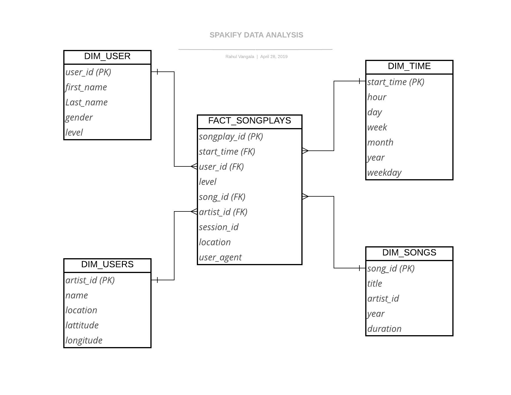

## PROJECT_1A SUBMISSION

### Introduction
<p><strong>Sparkify</strong>, a new startup company with a music streaming app, it wants to analyze how the music streaming app is performing with the users. It collects user activity of the songs in JSON format and song data is also JSON formt.</p>

### Problem Description
Create a ETL data model in __POSTGRE__ that can be used to analyze user questions on how songs by artists are performing. The Analytics team want to do analysis on the user data and perform query's to measure the app and song activity.

* User Activity Sample JSON record 
``` json 
{"artist":"A Fine Frenzy","auth":"Logged In","firstName":"Anabelle","gender":"F","itemInSession":0,"lastName":"Simpson","length":267.91138,"level":"free","location":"Philadelphia-Camden-Wilmington, PA-NJ-DE-MD","method":"PUT","page":"NextSong","registration":1541044398796.0,"sessionId":256,"song":"Almost Lover (Album Version)","status":200,"ts":1541377992796,"userAgent":"\"Mozilla\/5.0 (Macintosh; Intel Mac OS X 10_9_4) AppleWebKit\/537.36 (KHTML, like Gecko) Chrome\/36.0.1985.125 Safari\/537.36\"","userId":"69"}
```
* Song Metadata Sample JSON record
``` json 
{"num_songs": 1, "artist_id": "AREVWGE1187B9B890A", "artist_latitude": -13.442, "artist_longitude": -41.9952, "artist_location": "Noci (BA)", "artist_name": "Bitter End", "song_id": "SOFCHDR12AB01866EF", "title": "Living Hell", "duration": 282.43546, "year": 0}
```
### Technical Documentation
Load data into DIM and FACT tables using the files from LOG data and song data. 
* Load data into __Time, Artist, Users, Songs__ tables while loading generate Surrogate keys in each tables.
* Load data into __Songplays__ fact table, insert DIM table surrogate keys into FACT table for analysis. 
* Use python scripts into POSTGRES table.


 

 
 
 
    
