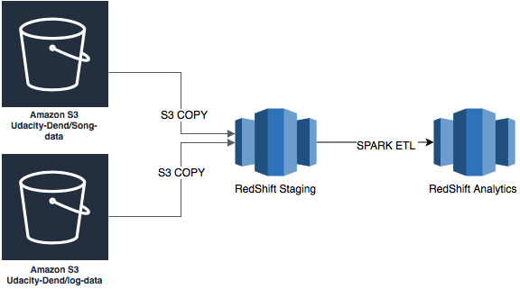

## PROJECT: Redshift Cloud Data Warehouse

#### Introduction
Music Streaming startup __Sparkify__, has grown their user base and song database and want to move and data onto cloud. Data resides in S3, in a directory of JSON logs on user activity, as well as directory with JSON metadata on the songs in the app. 

#### Problem Statement 
To analyze and get insights on user activityt and app performace, Build and Deploy AWS redshift Data warehouse to extract and transform S3 logs and song metadata to populate Dim and FACT tables.

#### ETL Flow diagram


#### Technical Details
* User Activity Sample JSON record
``` json 
{"artist":"A Fine Frenzy","auth":"Logged In","firstName":"Anabelle","gender":"F","itemInSession":0,"lastName":"Simpson","length":267.91138,"level":"free","location":"Philadelphia-Camden-Wilmington, PA-NJ-DE-MD","method":"PUT","page":"NextSong","registration":1541044398796.0,"sessionId":256,"song":"Almost Lover (Album Version)","status":200,"ts":1541377992796,"userAgent":"\"Mozilla\/5.0 (Macintosh; Intel Mac OS X 10_9_4) AppleWebKit\/537.36 (KHTML, like Gecko) Chrome\/36.0.1985.125 Safari\/537.36\"","userId":"69"}
```
* Song Metadata Sample JSON record
``` json 
{"num_songs": 1, "artist_id": "AREVWGE1187B9B890A", "artist_latitude": -13.442, "artist_longitude": -41.9952, "artist_location": "Noci (BA)", "artist_name": "Bitter End", "song_id": "SOFCHDR12AB01866EF", "title": "Living Hell", "duration": 282.43546, "year": 0}
```
* Staging Tables 
``` sql
staging_event_data
staging_song_data
```
* Fact Table 
``` sql
fact_songplay
```
* Dimension Tables
``` sql
dim_user
dim_time
dim_artist
dim_song
```
